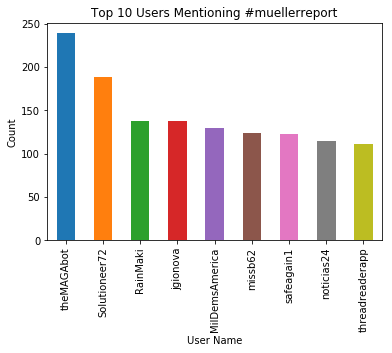
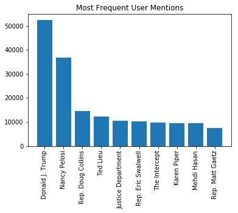
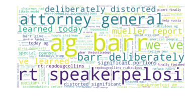
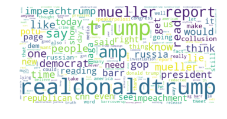
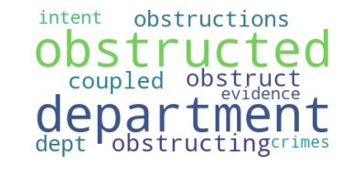
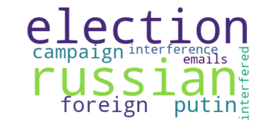

# SHIPBOB CASE STUDY
## Denny Kang

Task : Extract tweets from twitter.com regarding any popular topic using hashtag. No limitation
on the size of the data but make sure have enough data to build some machine learning model
using the data

For this case study, I decided to use the hashtag #muellerreport, a reference to the Special Counsel's investigation. I chose this hashtag because of the highly partisan opinions on the general subject, as well as the popularity of the topic.


```python
import tweepy
import json
import pandas as pd
import sys
import jsonpickle
import os

searchQuery = '#muellerreport'  # this is what we're searching for
maxTweets = 500000 # Some arbitrary large number
tweetsPerQry = 100  # this is the max the API permits
fName = 'C:/Users/Denny/twitter/tweets.txt' # We'll store the tweets in a text file.


access_token = "1482681518-opnSEWCP4usyNsqCHDaYQhJforMRJZqwjzLuUh5"
access_token_secret = "6rkv0J2JIguhywn8l9Qld2Qoa9TRaIkjaR7rBzD5FQNDJ"
consumer_key = "ea8nF8J01utJ9ZF5GNftMWB6X"
consumer_secret = "yQ20klsNwTOo0uUvq9cMB0dCyxQ0descoPL3oZI9lKNkkVMXlg"

#set up REST API
auth = tweepy.AppAuthHandler(consumer_key, consumer_secret)
api = tweepy.API(auth,wait_on_rate_limit = True,wait_on_rate_limit_notify=True)

#restricted in rate limit, trying to get as many tweets as possible in the time given
#source for maximizing tweets grabbed from 
#https://bhaskarvk.github.io/2015/01/how-to-use-twitters-search-rest-api-most-effectively./
tw_list = []

# If results only below a specific ID are, set max_id to that ID.
# else default to no upper limit, start from the most recent tweet matching the search query.
max_id = -1

tweetCount = 0
print("Downloading max {0} tweets".format(maxTweets))
with open(fName, 'w') as f:
    while tweetCount < maxTweets:
        try:
            if (max_id <= 0):
                    new_tweets = api.search(q=searchQuery, count=tweetsPerQry)
            else:
                    new_tweets = api.search(q=searchQuery, count=tweetsPerQry,
                                            max_id=str(max_id - 1))
            if not new_tweets:
                print("No more tweets found")
                break
            for tweet in new_tweets:
                tmp_dict = {
                    'created_at': tweet.created_at,
                    'coordinates' : tweet.coordinates,
                    'place' : tweet.place,
                    'text' : tweet.text,
                    'user' : tweet.user,
                    'entities' : tweet.entities,
                    'favorite_count' : tweet.favorite_count,
                    'retweet_count' : tweet.retweet_count}
                tw_list.append(tmp_dict)
                f.write(jsonpickle.encode(tweet._json, unpicklable=False) +
                        '\n')
                
            tweetCount += len(new_tweets)
            max_id = new_tweets[-1].id
        except tweepy.TweepError as e:
            # Just exit if any error
            print("some error : " + str(e))
            break

print ("Downloaded {0} tweets, Saved to {1}".format(tweetCount, fName))


#print("Tweet collection started")
#for tweet in tweepy.Cursor(api.search,
#              q="#muellerreport",
#              lang="en",
#              exclude_replies=True).items(20000):

```

    Downloading max 500000 tweets
    

    Rate limit reached. Sleeping for: 24
    Rate limit reached. Sleeping for: 253
    Rate limit reached. Sleeping for: 193
    Rate limit reached. Sleeping for: 199
    Rate limit reached. Sleeping for: 286
    Rate limit reached. Sleeping for: 169
    Rate limit reached. Sleeping for: 213
    Rate limit reached. Sleeping for: 315
    Rate limit reached. Sleeping for: 240
    Rate limit reached. Sleeping for: 264
    Rate limit reached. Sleeping for: 221
    Rate limit reached. Sleeping for: 207
    Rate limit reached. Sleeping for: 209
    

    Downloaded 500057 tweets, Saved to C:/Users/Denny/twitter/tweets.txt
    


```python
tweet_df = pd.DataFrame(tw_list)

#verify tweet data grabbed correctly
tweet_df.head()


#location data seems fairly sparse, will probably have to avoid using it
```


<div>
<style scoped>
    .dataframe tbody tr th:only-of-type {
        vertical-align: middle;
    }

    .dataframe tbody tr th {
        vertical-align: top;
    }

    .dataframe thead th {
        text-align: right;
    }
</style>
<table border="1" class="dataframe">
  <thead>
    <tr style="text-align: right;">
      <th></th>
      <th>coordinates</th>
      <th>created_at</th>
      <th>entities</th>
      <th>favorite_count</th>
      <th>place</th>
      <th>retweet_count</th>
      <th>text</th>
      <th>user</th>
    </tr>
  </thead>
  <tbody>
    <tr>
      <th>0</th>
      <td>None</td>
      <td>2019-04-24 03:13:25</td>
      <td>{'hashtags': [], 'symbols': [], 'user_mentions...</td>
      <td>0</td>
      <td>None</td>
      <td>5038</td>
      <td>RT @SpeakerPelosi: Our Founders spoke about ho...</td>
      <td>User(_api=&lt;tweepy.api.API object at 0x000001CE...</td>
    </tr>
    <tr>
      <th>1</th>
      <td>None</td>
      <td>2019-04-24 03:13:24</td>
      <td>{'hashtags': [{'text': 'MuellerReport', 'indic...</td>
      <td>0</td>
      <td>None</td>
      <td>31</td>
      <td>RT @grantstern: Jee, I wonder why Saudi Arabia...</td>
      <td>User(_api=&lt;tweepy.api.API object at 0x000001CE...</td>
    </tr>
    <tr>
      <th>2</th>
      <td>None</td>
      <td>2019-04-24 03:13:22</td>
      <td>{'hashtags': [], 'symbols': [], 'user_mentions...</td>
      <td>0</td>
      <td>None</td>
      <td>2810</td>
      <td>RT @RepDougCollins: Attorney General Barr has ...</td>
      <td>User(_api=&lt;tweepy.api.API object at 0x000001CE...</td>
    </tr>
    <tr>
      <th>3</th>
      <td>None</td>
      <td>2019-04-24 03:13:22</td>
      <td>{'hashtags': [{'text': 'MuellerReport', 'indic...</td>
      <td>0</td>
      <td>None</td>
      <td>2516</td>
      <td>RT @tedlieu: Dear @TheJusticeDept Bill Barr: M...</td>
      <td>User(_api=&lt;tweepy.api.API object at 0x000001CE...</td>
    </tr>
    <tr>
      <th>4</th>
      <td>None</td>
      <td>2019-04-24 03:13:21</td>
      <td>{'hashtags': [{'text': 'MuellerReport', 'indic...</td>
      <td>0</td>
      <td>None</td>
      <td>35</td>
      <td>RT @grantstern: Anyone who slams the #MuellerR...</td>
      <td>User(_api=&lt;tweepy.api.API object at 0x000001CE...</td>
    </tr>
  </tbody>
</table>
</div>


```python
#saving tweets to avoid rerunning initial tweet pull
tweet_df.to_csv('C:/Users/Denny/twitter/report_tweets.csv', index=False)
```


```python
#extract some of the fields in entities and user
tweet_df['hashtags'] = tweet_df['entities'].apply(lambda entity: entity['hashtags'])
tweet_df['symbols'] = tweet_df['entities'].apply(lambda entity: entity['symbols'])
tweet_df['user_mentions'] = tweet_df['entities'].apply(lambda entity: entity['user_mentions'])
tweet_df['user_description'] = tweet_df['user'].apply(lambda user: user.description)
tweet_df['user_name'] = tweet_df['user'].apply(lambda user: user.screen_name)
tweet_df['user_followers_count'] = tweet_df['user'].apply(lambda user: user.followers_count)
tweet_df['user_statuses_count'] = tweet_df['user'].apply(lambda user: user.statuses_count)
tweet_df['user_favourites_count'] = tweet_df['user'].apply(lambda user: user.favourites_count)
```


```python
#plot most frequent users of the hashtag
user_num_tweets = tweet_df.groupby('user_name')['created_at'].count().sort_values(ascending=False)
ax = user_num_tweets[1:10].plot(kind='bar',title='Top 10 Users Mentioning #muellerreport')
ax.set_xlabel('User Name')
ax.set_ylabel('Count')
plt.show()
```





```python
tweet_df['user_mentions'].iloc[12]
```


    [{'id': 25157561,
      'id_str': '25157561',
      'indices': [3, 16],
      'name': 'Harvard Book Store',
      'screen_name': 'HarvardBooks'}]


```python
from collections import Counter

user_mention_counter = Counter()
for user_mentions in tweet_df['user_mentions']:
    names = [mention['name'] for mention in user_mentions]
    user_mention_counter.update(names)
most_common = user_mention_counter.most_common(10)
vals = [y for x,y in most_common]
labels = [x for x,y in most_common]
ax = plt.bar(range(10),vals,align='center',tick_label = labels)
plt.title('Most Frequent User Mentions')
plt.xticks(rotation=90)
plt.show()
```





```python
import re
import string
from wordcloud import WordCloud
from nltk.corpus import stopwords
from matplotlib import pyplot as plt

#standard preprocessing on text, removing all punctuation, converting to lower case,
#returning a cleaned string
def clean_text(text):
    text = text.lower()
    #remove all punctuation
    remv_punct = text.translate(str.maketrans('', '', string.punctuation + '…'))
    #split on whitespace
    tokens = re.split(r'[\s]+',remv_punct)
    #remove all urls and remove all stop words
    stopWords = set(stopwords.words('english'))
    rmv_url = [token for token in tokens if 'http' not in token and token not in stopWords]
    return rmv_url

#decompose tweets into tokens
tweet_df['tokens'] = [clean_text(tweet) for tweet in tweet_df['text']]
tweet_df['cleaned_text'] = tweet_df.apply(lambda row: ' '.join(row['tokens']),axis = 1)
long_text = ' '.join(tweet for tweet in tweet_df['cleaned_text'])
#removing muellerreport and mullerreport form the wordcloud, as it will appear in every tweet
wordcloud = WordCloud(stopwords = ['muellerreport','mullerreport'],
                      background_color = 'white',height=400,width=800,
                      collocation=False).generate(long_text)
plt.imshow(wordcloud,interpolation='bilinear')
plt.axis('off')
plt.show()

```





One of the most common word in the raw data grab is RT, so there may very well be a ton of duplicate tweets in the corpus. To avoid this issue, we can filter out all the tweets that start with RT @ to get all the unique tweets on this topic. We can still keep the raw data, using retweet information can be used to create things like follower graphs to see how often people retweet each other.


```python
#use a boolean mask to filter out tweets that start with RT @
rt_mask = list(tweet_df.apply(lambda row: not 'RT @' in row['text'],axis=1))
tweet_df_no_rt = tweet_df[rt_mask]
print(tweet_df_no_rt.shape)

#regenerate word cloud
long_text = ' '.join(tweet for tweet in tweet_df_no_rt['cleaned_text'])
wordcloud = WordCloud(stopwords = ['muellerreport','mullerreport'],
                      background_color = 'white',height=400,width=800,
                      collocation=False).generate(long_text)
plt.imshow(wordcloud,interpolation='bilinear')
plt.axis('off')
plt.show()
```

    (75051, 17)
    





Removing all retweets gave different results, most notably the phrase "deliberately distorted" seems to have dropped in significance. We can see that the most frequent term is Trump's twitter handle. It should be noted that most of the tweets grabbed in the initial pull were retweets (only 75,000 out of 500,000 were non retweets). Further analysis will be conducted on non retweets for reasons stated above.


```python
cntr = Counter()
for tweet in tweet_df_no_rt['tokens']:
    cntr.update(tweet)
print(cntr.most_common(50))
```

    [('muellerreport', 46716), ('trump', 11024), ('realdonaldtrump', 10400), ('mueller', 5893), ('report', 4958), ('read', 4414), ('impeachtrump', 3850), ('amp', 3643), ('president', 2946), ('like', 2434), ('barr', 2363), ('people', 2275), ('maga', 2210), ('obstruction', 2054), ('one', 2040), ('know', 1950), ('would', 1935), ('impeachment', 1919), ('russia', 1895), ('democrats', 1867), ('time', 1857), ('get', 1803), ('gop', 1749), ('collusion', 1738), ('us', 1669), ('congress', 1641), ('reading', 1501), ('russian', 1467), ('redacted', 1460), ('trumpcolluded', 1453), ('cnn', 1415), ('potus', 1376), ('think', 1363), ('says', 1302), ('speakerpelosi', 1297), ('barrcoverup', 1291), ('even', 1290), ('im', 1273), ('said', 1272), ('news', 1263), ('see', 1262), ('investigation', 1252), ('justice', 1250), ('dont', 1242), ('still', 1219), ('need', 1210), ('say', 1197), ('right', 1186), ('2', 1170), ('house', 1166)]
    


```python
import gensim
#create Word2Vec embeddings of words to find similar terms
word2vec_model = gensim.models.Word2Vec(tweet_df_no_rt['tokens'],min_count =10)
```


```python
#create some word maps based on choice frequent terms and their most similar terms
def generate_most_similar_terms(word):
    kv = word2vec_model.wv.most_similar(word,topn=10)
    word_map_string = []
    for x,y in kv:
        similarity = round(100*y)
        word_map_string = word_map_string + ([x]*similarity)
    most_similar_terms = ' '.join(word_map_string)
    wordcloud = WordCloud(background_color = 'white',collocations=False).generate(most_similar_terms)
    plt.imshow(wordcloud,interpolation='bilinear')
    plt.axis('off')
    plt.show()
print('Obstruction :')
generate_most_similar_terms('obstruction')
print('Barr :')
generate_most_similar_terms('barr')
print('Russia :')
generate_most_similar_terms('russia')
```

    Obstruction :
    





    Barr :
    


    Russia :
    





The Word2Vec model produces logical results, and returns words that arise in the context of a given term.


```python
#use average of word2vec embeddings to generate vector representations of each tweet
import numpy as np

def doc_vector(tokens,model):
    vecs = [model.wv[token] for token in tokens if token in model.wv]
    if vecs:
        return np.average(vecs,axis=0)
    return None

tweet_df_no_rt['doc_vec'] = tweet_df_no_rt['tokens'].apply(lambda row: doc_vector(row,word2vec_model))
```

    C:\Users\Denny\Anaconda3\lib\site-packages\ipykernel_launcher.py:10: SettingWithCopyWarning: 
    A value is trying to be set on a copy of a slice from a DataFrame.
    Try using .loc[row_indexer,col_indexer] = value instead
    
    See the caveats in the documentation: http://pandas.pydata.org/pandas-docs/stable/indexing.html#indexing-view-versus-copy
      # Remove the CWD from sys.path while we load stuff.
    


```python
#create Doc2Vec embeddings of tweets to use in cluster analysis
docs = [gensim.models.doc2vec.TaggedDocument(doc,[i]) for i,doc in enumerate(tweet_df_no_rt['tokens'])]
model = gensim.models.doc2vec.Doc2Vec(vector_size=50, min_count=10, epochs=100,workers=2)
model.build_vocab(docs)
model.train(docs, total_examples=model.corpus_count, epochs=model.epochs)
tweet_df['doc2vecs'] = [model.infer_vector[doc] for doc in tweet_df_no_rt['tokens']]

```


```python
#create k-means cluster to infer global structure of tweets
from sklearn.cluster import KMeans
tweet_df_no_rt['doc_vec'].fillna(tweet_df_no_rt['doc_vec'].mean())

kmeans = KMeans(n_clusters=3, random_state=42).fit(list(tweet_df_no_rt['doc_vec']))

tweet_df['kmeans_cluster'] = kmeans.labels_
for i in range(3):
    cluster_ex = tweet_df_no_rt[tweet_df_no_rt['kmeans_cluster'] == i].iloc[0:3]
    for x in cluster_ex:
        print(x['text'])

```
